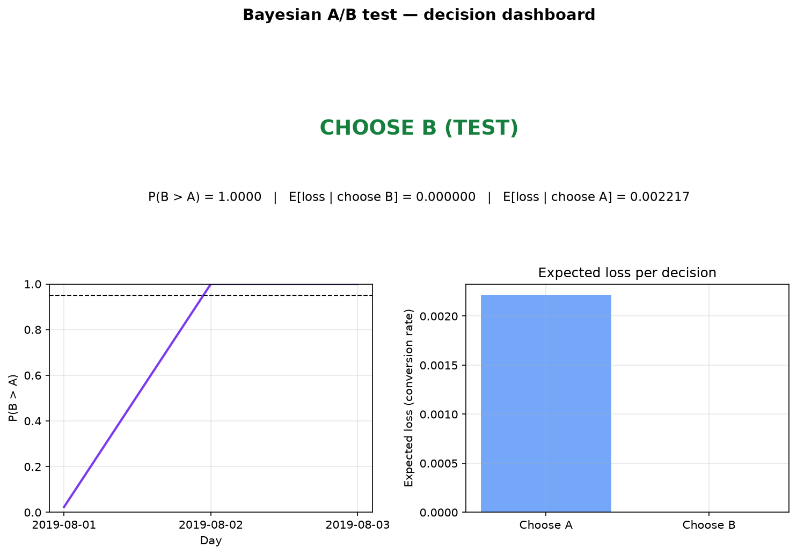
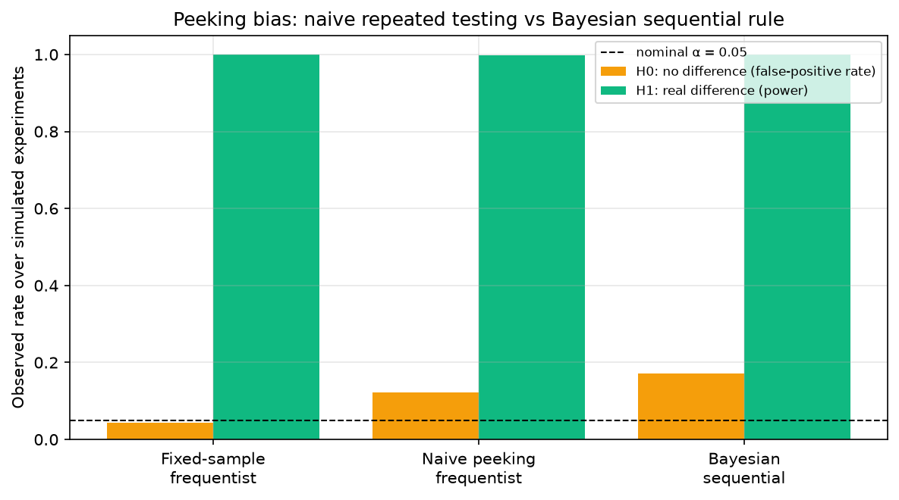

# Bayesian A/B Testing Engine

A production-style Bayesian A/B testing toolkit — Beta-Binomial conjugate posteriors, expected-loss decision rules, sequential early stopping, prior sensitivity analysis, sample-size planning, and an honest frequentist comparison — applied end-to-end to **real** 30-day Facebook marketing campaign data.

## Problem statement

A company ran two Facebook ad campaigns in August 2019 (control vs. test creative) and needs a ship/no-ship decision on the test variant. The questions:

1. What is the probability the test variant truly converts better — not a p-value, a direct probability?
2. If we ship the test variant and are wrong, how much conversion rate do we expect to lose?
3. Could we have stopped the experiment early instead of running all 30 days?
4. Do the conclusions survive different priors, and how should the *next* experiment be sized?

## Methodology

- **Model.** Independent Beta-Binomial conjugate models per variant:
  posterior = Beta(α₀ + s, β₀ + n − s). Derivations in [`docs/math_notes.md`](docs/math_notes.md).
- **Decision quantities.** Posterior P(B > A) by quadrature in quantile space
  (stable for tight, large-n posteriors); expected loss of each choice
  E[max(p_other − p_chosen, 0)] via an exact Beta identity + quadrature.
- **Sequential monitoring.** After each campaign day, stop when P(B > A) ≥ 0.95
  (or ≤ 0.05) or when the leader's expected loss is negligible (< 0.05pp).
- **Frequentist cross-check.** Two-proportion z-test, χ² test, Wald CI —
  reported for comparison, not as the decision rule.
- **Robustness.** Prior sensitivity (uniform / Jeffreys / informative historical);
  peeking-bias simulation comparing fixed-sample, naive-peeking, and Bayesian
  sequential strategies under H₀ and H₁ (2,000 simulated experiments each).
- **Planning.** Frequentist power analysis + Bayesian assurance (simulation of
  the actual decision rule) for sizing a future experiment.

## Results (from the reference run — `results/metrics.json`)

Data: control 15,161 / 3,177,233 (0.4772%), test 15,637 / 2,237,544 (0.6988%)
— absolute lift **+0.2217pp**, relative lift **+46.45%**.

| Analysis | Result |
|---|---|
| P(test > control) — uniform prior | **1.0000** (to machine precision) |
| 95% credible intervals | control [0.470%, 0.485%], test [0.688%, 0.710%] |
| Expected loss of shipping test | **≈ 0** (below numerical precision) |
| Expected loss of keeping control | **0.002217** (the foregone lift) |
| **Decision** | **Ship the test variant** |
| Sequential stopping | Decided on **day 3 of 30**, using **10.1%** of the data |
| Frequentist z-test | z = 33.78, p = 4.6e−250; 95% CI for lift [0.208pp, 0.235pp] |
| χ² test | χ² = 1140.4, p = 5.6e−250 |
| Prior sensitivity | P(B > A) = 1.000 under uniform, Jeffreys, and historical Beta(5,995) priors |
| Sample size for next test (detect 0.5% → 0.7%, 80% power) | **23,405** per variant (frequentist); Bayesian assurance 89% at 25k, 99% at 50k |

### Peeking-bias simulation (2,000 experiments, 10 peeks each)

| Strategy | H₀: false-decision rate | H₁: power |
|---|---|---|
| Fixed-sample frequentist (single final test) | 4.3% | 100% |
| Naive peeking (p < 0.05 at any peek) | **12.3%** | 99.7% |
| Bayesian sequential (P(B>A) > 0.95 at any peek) | 17.2% decide-B | 100% |

The naive-peeking row is the classic mistake: repeated p-value checks nearly
**triple** the false-positive rate (4.3% → 12.3%). The Bayesian row is reported
honestly: monitoring continuously keeps the *posterior* valid (no distortion of
its meaning), but a 0.95 posterior threshold is **not** a frequentist error
guarantee — under H₀ it still decides ~17% of the time. If a stakeholder needs
strict Type I error control, calibrate the threshold or use a group-sequential
design instead. See `docs/math_notes.md` §4.




## How to run

```bash
pip install -r requirements.txt
pip install -e .
python scripts/run_analysis.py
```

Run the test suite: `python -m pytest tests/ -q` (28 tests).
Interactive walkthrough: `notebooks/01_bayesian_ab_analysis.ipynb`.

## Project structure

```
bayesian-ab-testing-engine/
├── src/bayes_ab/            # installable package
│   ├── models.py            # Beta-Binomial posterior, P(B>A), expected loss, credible intervals
│   ├── sequential.py        # sequential monitoring + peeking-bias simulation
│   ├── frequentist.py       # two-proportion z-test, chi-square, CIs
│   ├── sample_size.py       # frequentist power + Bayesian assurance
│   ├── priors.py            # prior sensitivity (uniform / Jeffreys / informative)
│   └── visualization.py     # posterior, trajectory, dashboard, comparison figures
├── data/
│   ├── control_group.csv / test_group.csv   # REAL raw campaign data (unmodified)
│   ├── clean/ab_daily.csv                   # tidy daily A/B table (generated)
│   └── README.md                            # source + limitations
├── scripts/run_analysis.py  # full end-to-end pipeline (figures + metrics.json)
├── notebooks/01_bayesian_ab_analysis.ipynb  # interactive walkthrough
├── tests/                   # 28 pytest tests vs analytical values & Monte Carlo
├── docs/math_notes.md       # full derivations (conjugacy, expected loss, peeking)
├── results/
│   ├── metrics.json         # every number in the README, from the actual run
│   ├── sequential_trajectory.csv / prior_sensitivity.csv
│   └── figures/             # generated plots
├── .github/workflows/ci.yml
├── requirements.txt         # pinned
└── pyproject.toml
```

## Reproducibility

- Fixed seed (`SEED = 42`) for every stochastic step: peeking simulations,
  assurance grid, and Monte Carlo cross-checks in tests.
- Pinned dependencies: `numpy==2.5.3`, `scipy==1.18.1`, `pandas==3.0.6`,
  `matplotlib==3.11.2`, `pytest==9.1.1` (Python 3.12).
- `results/metrics.json` is the committed record of the reference run;
  re-running `scripts/run_analysis.py` reproduces it exactly.

## Limitations & future work

- The dataset is **daily-aggregated campaign data**, not user-level randomization
  records: the randomization protocol can't be audited and sample-ratio mismatch
  can't be checked. Campaigns also differed in spend/reach, so the lift is best
  read as a demonstration of the statistical machinery, not a causal claim about
  creative alone (see `data/README.md`).
- Purchases are day-attributed with no attribution-window detail; delayed
  conversions could bias daily rates.
- The model assumes independent Bernoulli trials — no day-of-week effects,
  no novelty/fatigue, no interference between variants.
- Future work: hierarchical day-level model, Beta-Binomial with covariates,
  revenue (not just conversion) as the decision metric, calibrated Bayesian
  decision thresholds for strict frequentist error control, multi-armed
  bandit allocation for the next campaign.

## References

- Gelman et al., *Bayesian Data Analysis* (3rd ed.), Ch. 2–3
- Kruschke, *Doing Bayesian Data Analysis*, Ch. 11
- Berger, *Statistical Decision Theory and Bayesian Analysis*
- Data: [Arvi55/A-B-Testing-Analysis-using-Python](https://github.com/Arvi55/A-B-Testing-Analysis-using-Python) (control_group.csv, test_group.csv)

## License

MIT — see [LICENSE](LICENSE).
